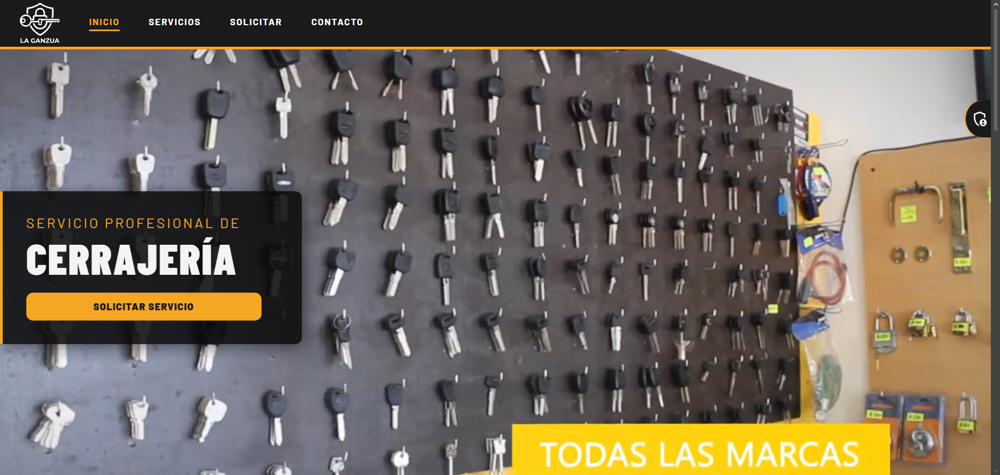
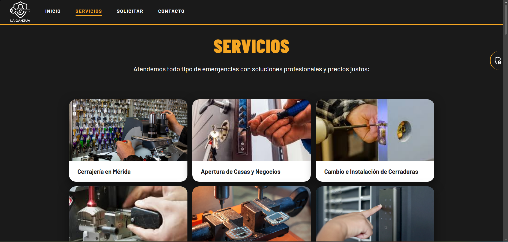
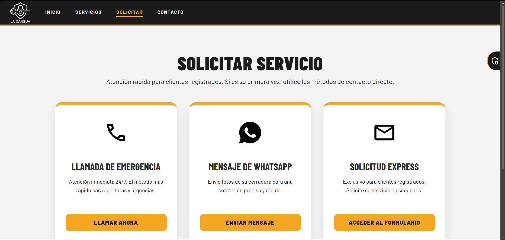
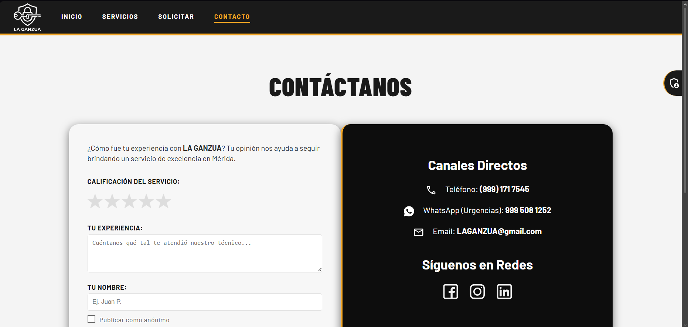
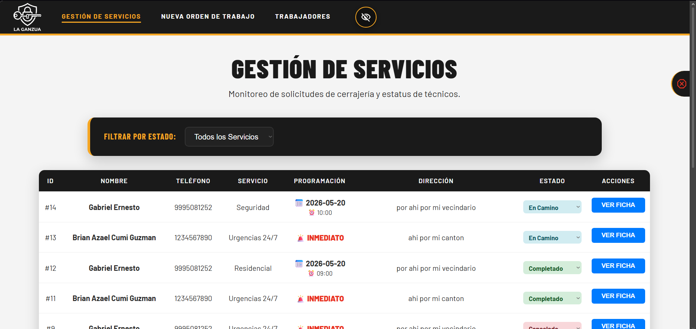
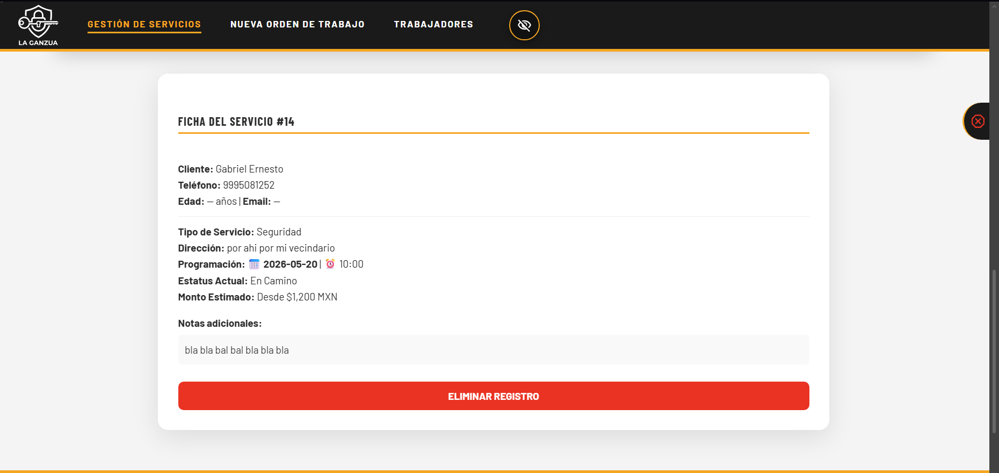
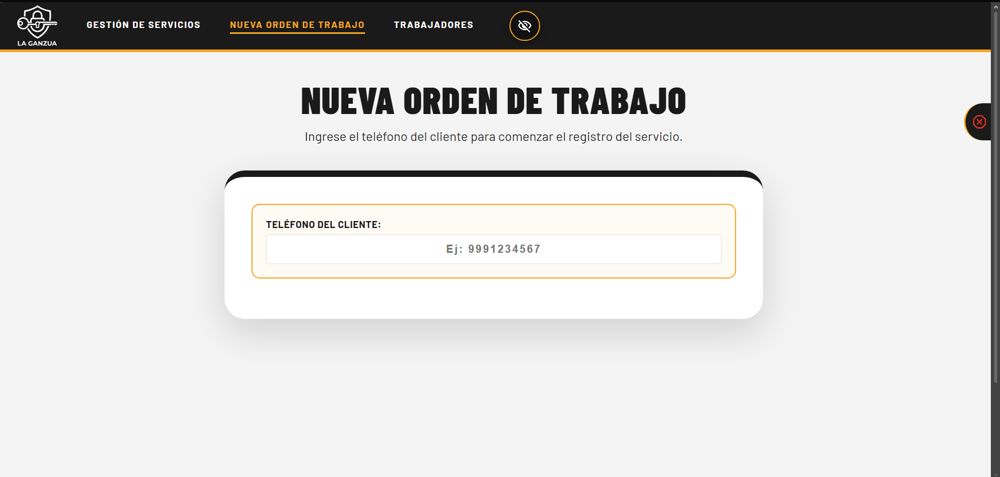
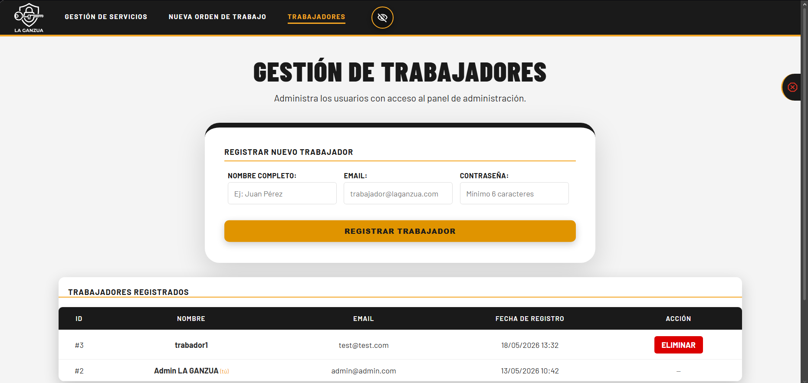
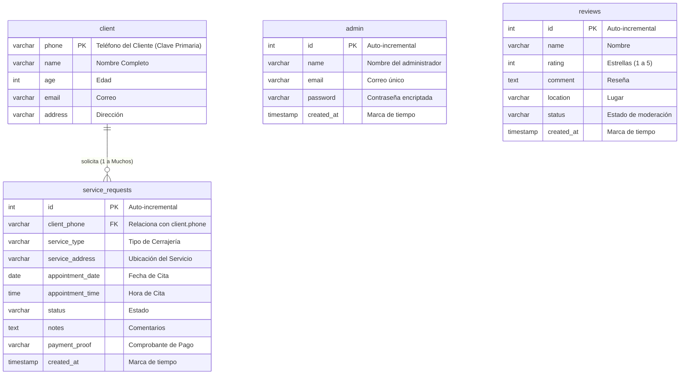

# 🔑 LA GANZUA — Sistema de Gestión de Cerrajería Profesional


**LA GANZUA** es una plataforma web completa para la gestión profesional de servicios de cerrajería. El sistema cubre desde el portal público donde los clientes solicitan sus servicios, hasta un panel administrativo privado con control total (CRUD) sobre las órdenes de trabajo, el personal y las reseñas de clientes.

> Proyecto Final — Materia: Programación Web  
> Institución: Universidad Politécnica de Yucatán  
> Docente: MINE. Héctor Cetina Cordero

---

## 📸 Vista General del Sistema

> **Instrucción:** Coloca las capturas de pantalla en la carpeta `img/vistaGeneral/` con los nombres indicados.

| Vista | Descripción |
| :--- | :--- |
|  | **Inicio:** Página principal con presentación del negocio. |
|  | **Servicios:** Catálogo completo con precios y categorías. |
|  | **Solicitar:** Formulario de registro de órdenes de trabajo. |
|  | **Contacto:** Sección de reseñas y mapa de ubicación. |
|  | **Login:** Portal de acceso al panel de administración. |
|  | **Dashboard:** Tabla de gestión de servicios activos. |
|  | **Ficha Modal:** Detalles completos de un servicio con monto estimado. |
|  | **Nueva Orden:** Formulario administrativo para registrar servicios. |
|  | **Trabajadores:** Módulo de alta y baja de personal. |

---

## 🚀 Funcionalidades del Sistema

### 🌐 Portal Público (Frontend)

#### 1. Página de Inicio (`index.php`)
- Presentación del negocio con identidad gráfica industrial premium.
- Imagen de portada, descripción de servicios y botón de llamada a la acción.
- Sección de proceso de servicio en 4 pasos ilustrados.
- Mapa interactivo de Google Maps con la ubicación en Mérida, Yucatán.
- Video informativo sobre el servicio de cerrajería.

#### 2. Catálogo de Servicios (`servicios.php`)
- Listado de los 4 tipos de servicios ofrecidos:
  - **Urgencias 24/7** — Atención inmediata sin cita.
  - **Residencial** — Hogares, condominios y fraccionamientos.
  - **Automotriz** — Aperturas y llaves de vehículos.
  - **Seguridad** — Instalación de chapa y cerraduras.
- Tabla de precios y tarifas fijas por categoría.
- Sección de opiniones y reseñas de clientes (aprobadas por el administrador).

#### 3. Solicitud de Servicio (`solicitar.php`)
- **Buscador inteligente de clientes por teléfono:** El sistema consulta en tiempo real si el número de teléfono ingresado ya está registrado en la base de datos.
  - Si el cliente **existe**: muestra sus datos para confirmar y evitar duplicados.
  - Si el cliente **no existe**: despliega el formulario de registro de datos nuevos.
- **Formulario multi-paso** con los siguientes controles:
  - `text` — Nombre completo del cliente.
  - `tel` — Teléfono de 10 dígitos (validado en tiempo real).
  - `number` — Edad del cliente.
  - `email` — Correo electrónico de contacto.
  - `select` — Tipo de servicio (Urgencias / Residencial / Automotriz / Seguridad).
  - `text` — Dirección del servicio.
  - `date` — Fecha de cita (bloqueada para fechas pasadas y domingos).
  - `time` — Hora de cita (restringida a horarios laborales).
  - `textarea` — Descripción del problema o notas adicionales.
  - `file` — Carga de comprobante de pago (imagen).
- **Validación con JavaScript** del lado del cliente antes de enviar los datos al servidor.
- **Agenda inteligente:** Los campos de fecha y hora solo aparecen para servicios programados (no urgencias).

#### 4. Contacto y Opiniones (`contacto.php`)
- Formulario de reseña pública con calificación de 1 a 5 estrellas (CSS puro).
- Campos: nombre, zona del servicio, calificación y comentario.
- Las opiniones se almacenan como "Pendiente" en la base de datos hasta que el administrador las aprueba.
- Información de contacto directo (teléfono, email).
- Mapa de Google Maps embebido.
- Botones de redes sociales.

---

### 🔐 Sistema de Autenticación

#### 5. Login de Administrador (`login.php` + `autentificar.php`)
- Formulario de inicio de sesión con `email` y `password`.
- Validación de credenciales contra la tabla `admin` de la base de datos.
- La contraseña se verifica con `verify_password()` (Bcrypt), **nunca en texto plano**.
- Al autenticarse correctamente, se inicializa una sesión PHP (`$_SESSION`) con el ID, nombre y rol del usuario.
- Función de cierre de sesión que destruye completamente la sesión del servidor (`session_destroy()`).

---

### 🛠️ Panel de Administración (Dashboard)

Todas las vistas del panel están protegidas por `require_admin_login()`. Si un usuario intenta acceder por URL sin sesión activa, es redirigido automáticamente al login.

#### 6. Gestión de Servicios (`dashboard_ver.php`)
Vista principal del panel. Muestra todos los servicios registrados en una tabla interactiva con:
- **ID**, **Nombre del Cliente**, **Teléfono**, **Tipo de Servicio**, **Programación**, **Dirección** y **Estado**.
- **Selector de Estado Inline (AJAX):** La columna "Estado" contiene un `<select>` que actualiza el registro en la base de datos **en tiempo real sin recargar la página** (usando `Fetch API`). Los estados disponibles son:
  - `Pendiente` — Amarillo.
  - `En Camino` — Azul.
  - `Completado` — Verde.
  - `Cancelado` — Rojo.
- **Botón "Ver Ficha":** Abre un modal deslizante con la ficha técnica completa del servicio, incluyendo:
  - Datos del cliente, dirección, notas del problema, imagen del comprobante y **Monto Estimado** (precio fijo basado en el tipo de servicio).
  - Botón de **Eliminar Registro** (con confirmación de doble verificación vía `confirm()`).

#### 7. Nueva Orden de Trabajo (`dashboard_crear.php`)
Formulario administrativo para registrar una nueva solicitud de servicio desde el panel:
- Buscador de cliente por teléfono (mismo sistema AJAX que el formulario público).
- Si el cliente no existe, despliega el registro de datos del nuevo cliente.
- Permite registrar el servicio con tipo, dirección, fecha y hora de cita.

#### 8. Gestión de Trabajadores (`dashboard_trabajadores.php`)
Módulo para administrar las cuentas con acceso al panel:
- **Formulario de registro** de nuevo trabajador (Nombre, Email, Contraseña).
  - La contraseña se cifra automáticamente con `hash_password()` (Bcrypt, costo 10) antes del `INSERT`.
- **Tabla de personal** con todos los administradores activos (ID, Nombre, Email, Fecha de Alta).
- **Botón de Eliminar** por cada trabajador, con protección que impide que el usuario activo se elimine a sí mismo.

---

## 🗄️ Estructura de la Base de Datos

La base de datos `cerrajeria_db` cuenta con 4 tablas relacionadas y está diseñada bajo principios de **normalización relacional** para evitar la redundancia de datos.

### Diagrama Entidad-Relación (MER)



### Detalle de Columnas por Tabla

#### Tabla `client` — Información de Clientes
| Campo | Tipo | Clave | Descripción |
| :--- | :---: | :---: | :--- |
| `phone` | `VARCHAR(15)` | **PK** | Teléfono único. Funciona como identificador del cliente. |
| `name` | `VARCHAR(100)` | — | Nombre completo del cliente. |
| `age` | `INT(3)` | — | Edad del cliente. |
| `email` | `VARCHAR(100)` | — | Correo electrónico de contacto. |
| `address` | `VARCHAR(255)` | — | Dirección predeterminada del domicilio. |

#### Tabla `service_requests` — Órdenes de Servicio
| Campo | Tipo | Clave | Descripción |
| :--- | :---: | :---: | :--- |
| `id` | `INT(11)` | **PK** | Identificador único de la orden (auto-incremental). |
| `client_phone` | `VARCHAR(15)` | **FK** | Enlaza la orden con el cliente en la tabla `client`. |
| `service_type` | `VARCHAR(50)` | — | Categoría del servicio (*Urgencias 24/7*, *Residencial*, *Automotriz*, *Seguridad*). |
| `service_address` | `VARCHAR(255)` | — | Dirección exacta donde se realizará el servicio. |
| `appointment_date` | `DATE` | — | Fecha programada de la cita. |
| `appointment_time` | `TIME` | — | Hora programada de la cita. |
| `status` | `VARCHAR(30)` | — | Estado actual: *Pendiente*, *En Camino*, *Completado*, *Cancelado*. |
| `notes` | `TEXT` | — | Descripción del problema o comentarios del técnico. |
| `payment_proof` | `VARCHAR(255)` | — | Ruta de la imagen del comprobante de pago. |
| `created_at` | `TIMESTAMP` | — | Fecha y hora de creación del registro (automático). |

#### Tabla `admin` — Cuentas de Personal
| Campo | Tipo | Clave | Descripción |
| :--- | :---: | :---: | :--- |
| `id` | `INT(11)` | **PK** | Identificador único del administrador (auto-incremental). |
| `name` | `VARCHAR(100)` | — | Nombre del trabajador. |
| `email` | `VARCHAR(100)` | **Unique** | Correo electrónico de acceso (único en el sistema). |
| `password` | `VARCHAR(255)` | — | Contraseña cifrada con Bcrypt (`$2y$10$...`). |
| `created_at` | `TIMESTAMP` | — | Fecha de alta del usuario (automático). |

#### Tabla `reviews` — Reseñas Públicas
| Campo | Tipo | Clave | Descripción |
| :--- | :---: | :---: | :--- |
| `id` | `INT(11)` | **PK** | Identificador único de la reseña (auto-incremental). |
| `name` | `VARCHAR(100)` | — | Nombre de la persona que opina. |
| `rating` | `INT(1)` | — | Puntuación del 1 al 5. |
| `comment` | `TEXT` | — | Texto de la reseña del servicio. |
| `location` | `VARCHAR(100)` | — | Zona o colonia donde se atendió al cliente. |
| `status` | `VARCHAR(20)` | — | Estado de moderación: *Pendiente* (default) o *Aprobado*. |
| `created_at` | `TIMESTAMP` | — | Fecha de envío de la reseña (automático). |

---

## 🛡️ Seguridad

El sistema está construido sobre tres pilares de seguridad fundamentales:

### 1. Cifrado Centralizado de Contraseñas (`seguridad.php`)
Todo el procesamiento criptográfico está encapsulado en funciones propias dentro de `seguridad.php`:

```php
// Encripta la contraseña con Bcrypt, costo de trabajo 10
function hash_password($password) {
    return password_hash($password, PASSWORD_BCRYPT, ['cost' => 10]);
}

// Verifica una contraseña contra su hash almacenado
function verify_password($password, $hash) {
    return password_verify($password, $hash);
}
```

- Las contraseñas **nunca se guardan en texto plano**. Se almacenan como un hash irreversible de 60 caracteres (`$2y$10$...`).
- Si se necesita cambiar el algoritmo o el costo, **solo se modifica `seguridad.php`** y el cambio se propaga automáticamente.

### 2. Prevención de Inyecciones SQL (PDO con Sentencias Preparadas)
Todas las interacciones con la base de datos usan sentencias preparadas con parámetros enlazados:

```php
$stmt = $db->prepare("UPDATE service_requests SET status = :new_status WHERE id = :id");
$stmt->execute([':new_status' => $new_status, ':id' => $id]);
```

Esto garantiza que los inputs del usuario **nunca se interpreten como comandos SQL**, neutralizando ataques de tipo SQL Injection.

### 3. Control de Sesiones y Acceso por Roles
- Todas las rutas del panel (`dashboard_*.php`) están protegidas por `require_admin_login()`.
- Si un usuario intenta acceder a una URL privada sin sesión activa, es redirigido automáticamente a `login.php`.
- El logout destruye completamente la sesión con `session_destroy()`.

---

## 📂 Estructura de Archivos del Proyecto

```
U5_proyect-Cerrajeria/
├── index.php                      # Página de inicio pública
├── servicios.php                  # Catálogo de servicios y precios
├── solicitar.php                  # Formulario de solicitud de servicio
├── contacto.php                   # Contacto, opiniones y mapa
├── login.php                      # Portal de acceso al panel admin
├── autentificar.php               # Lógica de autenticación y logout
├── seguridad.php                  # Control de sesiones y cifrado
├── conexion.php                   # Conexión PDO a la base de datos
├── dashboard_ver.php              # Panel: gestión de servicios (CRUD)
├── dashboard_crear.php            # Panel: nueva orden de trabajo
├── dashboard_trabajadores.php     # Panel: gestión de personal
├── eliminar.php                   # Handler de eliminación de registros
├── explicacion_tecnica_proyecto.md # Guía de defensa técnica del proyecto
│
├── css/
│   └── style.css                  # Hoja de estilos global (inline-block)
│
├── js/
│   ├── contacto.js                # Validación JS del formulario de contacto
│   ├── solicitar.js               # Lógica AJAX del buscador de clientes
│   └── index.js                   # Animaciones y efectos de la página de inicio
│
├── php/
│   ├── procesar_solicitud.php     # Backend: inserta nuevas órdenes de servicio
│   ├── guardar_opinion.php        # Backend: guarda las reseñas de clientes
│   ├── eliminar_opinion.php       # Backend: elimina reseñas (admin)
│   └── get_client.php             # Backend: consulta cliente por teléfono (AJAX)
│
├── includes/
│   ├── header.php                 # Cabecera y navegación (pública y admin)
│   ├── footer.php                 # Pie de página
│   ├── admin_bar.php              # Barra de acciones del administrador
│   └── seguridad.php              # (referencia) funciones de protección
│
├── img/
    ├── full_logo_tr.svg           # Logotipo vectorial del negocio
    ├── icons/                     # Iconos SVG de la interfaz
    ├── servicios/                 # Imágenes del catálogo de servicios
    └── vistaGeneral/              # Capturas de pantalla del sistema
        ├── screen-inicio.png
        ├── screen-servicios.png
        ├── screen-solicitar.png
        ├── screen-contacto.png
        ├── screen-login.png
        ├── screen-dashboard.png
        ├── screen-ficha.png
        ├── screen-orden.png
        └── screen-trabajadores.png
```

---

## 🛠️ Stack Tecnológico

| Capa | Tecnología | Detalle |
| :--- | :---: | :--- |
| **Frontend** | HTML5 | Estructura semántica con `div`'s organizados por secciones. |
| **Estilos** | CSS3 Vanilla | Maquetación estricta con `display: inline-block` (sin Flexbox ni Grid). Variables CSS en `:root` para paleta corporativa. |
| **Interactividad** | JavaScript ES6+ | Validaciones del lado del cliente, Fetch API para AJAX, manipulación del DOM. |
| **Backend** | PHP 7.4+ | Arquitectura modular con `include`. Separación de lógica en carpeta `php/`. |
| **Base de Datos** | MySQL / MariaDB | 4 tablas relacionadas. Consultas con `JOIN`. PDO para interacción segura. |
| **Servidor Local** | XAMPP | Apache + PHP + MariaDB. |
| **Seguridad** | Bcrypt + PDO | Contraseñas encriptadas con costo 10. Sentencias preparadas contra SQLi. |

---

## ⚙️ Instalación Local

1.  **Clona el repositorio:**
    ```bash
    git clone https://github.com/5t4t1cV01d/locksmith-project.git
    ```

2.  **Mueve la carpeta** al directorio raíz de tu servidor local:
    ```
    C:\xampp\htdocs\U5_proyect-Cerrajeria\
    ```

3.  **Crea la base de datos** en phpMyAdmin o MySQL:
    ```sql
    CREATE DATABASE cerrajeria_db CHARACTER SET utf8mb4 COLLATE utf8mb4_unicode_ci;
    ```

4.  **Crea las tablas** ejecutando el siguiente SQL:
    ```sql
    USE cerrajeria_db;

    CREATE TABLE client (
        phone VARCHAR(15) NOT NULL PRIMARY KEY,
        name VARCHAR(100) NOT NULL,
        age INT(3) NOT NULL,
        email VARCHAR(100) NOT NULL,
        address VARCHAR(255) NOT NULL
    );

    CREATE TABLE service_requests (
        id INT(11) AUTO_INCREMENT PRIMARY KEY,
        client_phone VARCHAR(15) NOT NULL,
        service_type VARCHAR(50) NOT NULL,
        service_address VARCHAR(255) NOT NULL,
        appointment_date DATE,
        appointment_time TIME,
        status VARCHAR(30) NOT NULL DEFAULT 'Pendiente',
        notes TEXT,
        payment_proof VARCHAR(255),
        created_at TIMESTAMP DEFAULT current_timestamp(),
        FOREIGN KEY (client_phone) REFERENCES client(phone)
    );

    CREATE TABLE admin (
        id INT(11) AUTO_INCREMENT PRIMARY KEY,
        name VARCHAR(100) NOT NULL,
        email VARCHAR(100) NOT NULL UNIQUE,
        password VARCHAR(255) NOT NULL,
        created_at TIMESTAMP DEFAULT current_timestamp()
    );

    CREATE TABLE reviews (
        id INT(11) AUTO_INCREMENT PRIMARY KEY,
        name VARCHAR(100) NOT NULL,
        rating INT(1) NOT NULL,
        comment TEXT NOT NULL,
        location VARCHAR(100) NOT NULL,
        status VARCHAR(20) NOT NULL DEFAULT 'Pendiente',
        created_at TIMESTAMP DEFAULT current_timestamp()
    );
    ```

5.  **Crea el primer usuario administrador** (la contraseña se cifra con Bcrypt):
    ```sql
    INSERT INTO admin (name, email, password)
    VALUES ('Admin LA GANZUA', 'admin@admin.com', '$2y$10$TU_HASH_BCRYPT_AQUI');
    ```
    > O bien, utiliza el módulo "Gestión de Trabajadores" dentro del panel para registrar el primer usuario desde la interfaz.

6.  **Configura las credenciales** de la base de datos en `conexion.php`:
    ```php
    $host = 'localhost';
    $db   = 'cerrajeria_db';
    $user = 'root';
    $pass = '';
    ```

7.  **Accede al sistema** desde tu navegador:
    ```
    http://localhost/U5_proyect-Cerrajeria/
    ```

---

## 🎨 Paleta de Colores Corporativa

| Color | HEX | Uso |
| :--- | :---: | :--- |
| Negro Carbón | `#1a1a1a` | Fondo principal, headers, navbar. |
| Amarillo Ámbar | `#f5a623` | Acentos, botones primarios, íconos activos. |
| Blanco Puro | `#ffffff` | Texto sobre fondos oscuros, tarjetas. |
| Rojo Emergencia | `#dc0000` | Botones destructivos, alertas de error. |

---

*Proyecto desarrollado para la materia de Programación Web como proyecto final de la carrera.*
