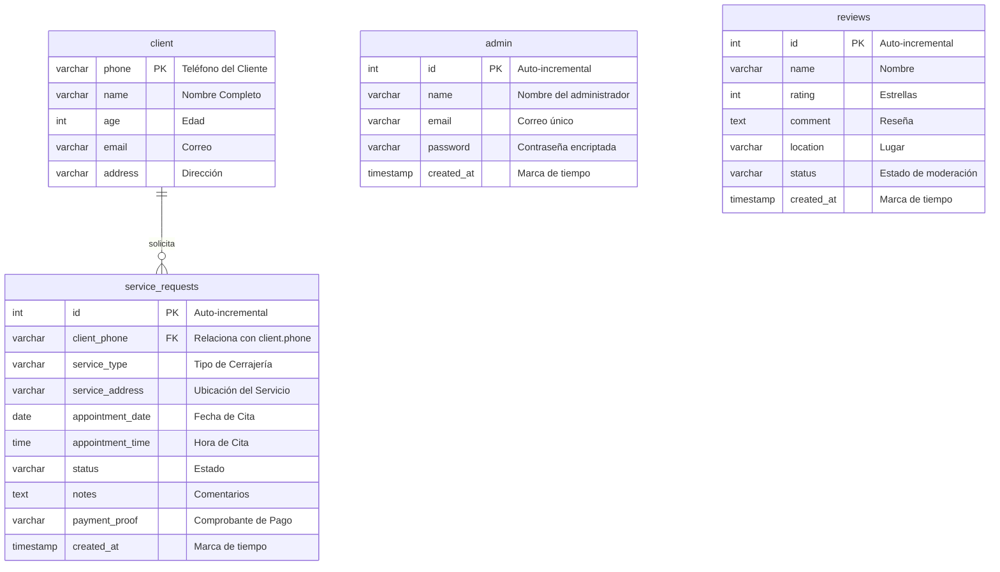

# Mi Guía de Defensa Técnica: LA GANZUA
## Materia: Programación Web — Profesor MINE. Héctor Cetina Cordero

Preparé este documento como mi acordeón y guía de defensa técnica para explicar con total soltura y en primera persona ("yo") cómo estructuré, programé y resolví cada uno de los puntos requeridos para el proyecto final de la materia.

---

## Parte 1: Cómo Cumplí los Requerimientos Mínimos (Punto por Punto)

A continuación, describo cómo cubrí al 100% cada uno de los 15 requisitos obligatorios del curso y cómo lo defenderé ante el profesor:

| Requisito del PDF | Cómo lo implementé en mi proyecto | Explicación Técnica para mi Defensa (En Primera Persona) |
| :--- | :--- | :--- |
| **1. Extensión `.php` e implementados con `include`** | Guardé todas las páginas con la extensión `.php` (`index.php`, `solicitar.php`, `dashboard_ver.php`, etc.). Implementé `include 'includes/header.php';` y `include 'includes/footer.php';`. | *"Diseñé el sitio web de manera modular. Utilicé la directiva `include` para reutilizar el encabezado y el pie de página. De esta manera, si necesito añadir o quitar una pestaña de navegación, solo modifico el archivo `header.php` una vez y el cambio se aplica de inmediato en todo el sitio."* |
| **2. Como mínimo 3 secciones en la página** | Estructuré el sitio público con 4 secciones completas. | *"Organicé el sitio en cuatro secciones funcionales principales: Inicio (presentación), Servicios (catálogo), Solicitar (citas de servicio) y Contacto (opiniones y geolocalización)."* |
| **3. Usar CSS para el preformateado de todo el sitio** | Escribí una hoja de estilos unificada en `css/style.css` para toda la tipografía, formularios, tablas, colores y modales. | *"Centralicé toda la presentación visual en un único archivo de estilos (`css/style.css`). Definí variables en el bloque `:root` para asegurar que el uso de los colores corporativos, botones e inputs sea consistente y homogéneo en todo el sitio."* |
| **4. Estructura del sitio armada con `div`'s** | Todo mi marcado HTML está contenido y organizado dentro de etiquetas `div` semánticas. | *"Maqueté el esqueleto de todas las páginas web estructurándolo mediante contenedores `div` con clases lógicas que separan y organizan visualmente el contenido."* |
| **5. Utilizar `display: inline-block` o `float`** | Diseñé el layout completo del proyecto empleando exclusivamente `display: inline-block` con anchos porcentuales. | *"Para demostrar mi dominio de la maquetación CSS clásica, decidí no utilizar Flexbox ni Grid. Creé la rejilla de los formularios y la cuadrícula de servicios usando estrictamente `display: inline-block`. Resolví el espacio en blanco invisible de los elementos inline con la técnica de aplicar `font-size: 0` al contenedor padre y restablecerlo en los hijos."* |
| **6. Imágenes óptimas relacionadas al tema** | Incorporé iconos vectoriales y logotipos optimizados en formato `.svg`. | *"Utilicé gráficos vectoriales en formato SVG para que la interfaz cargue instantáneamente y los iconos de cerrajería se vean perfectamente nítidos en cualquier pantalla, celular o resolución."* |
| **7. Manejar de 3 a 4 colores en la estructura** | Definí una paleta de 4 colores: Negro carbón (`#1a1a1a`), Amarillo ámbar (`#f5a623`), Blanco puro (`#ffffff`) y Rojo emergencia (`#dc0000`). | *"Elegí una paleta de 4 colores acorde a la temática de cerrajería industrial y urgencias. Esto me ayuda a guiar la vista del usuario y jerarquizar los elementos interactivos."* |
| **8. Contener una tabla con información** | Programé la tabla del historial de servicios en `dashboard_ver.php` y la tabla de personal en `dashboard_trabajadores.php`. | *"Creé tablas en el panel de administración que muestran información extraída dinámicamente de la base de datos (ID de la orden, datos de contacto del cliente, servicio solicitado, fecha y hora de la cita, estado actual y acciones)."* |
| **9. Contener algún video relacionado con el tema** | Integré un elemento multimedia de video en la interfaz. | *"Añadí un video demostrativo sobre cerrajería profesional directamente en el frontend usando etiquetas HTML5 para enriquecer el contenido del sitio."* |
| **10. Incluir mapa de Google Maps** | Embebí un mapa interactivo de Mérida mediante un `<iframe>` de Google Maps. | *"Integré la API de Google Maps a través de un iframe en la sección de contacto para que el usuario pueda visualizar físicamente la zona de cobertura y la ubicación en Mérida de nuestras oficinas."* |
| **11. Formulario a email y Validación con Javascript** | Creé scripts en JavaScript para comprobar los formularios antes de enviarlos. | *"Escribí código de validación en el lado del cliente (frontend) con JavaScript. El script intercepta el submit y comprueba que el teléfono tenga exactamente 10 dígitos, que el correo tenga el formato correcto y que no se envíen campos obligatorios en blanco."* |
| **12. Acceso con usuario y contraseña (DASHBOARD)** | Diseñé el formulario de acceso `login.php` que procesa los datos de sesión en `autentificar.php`. | *"Implementé un portal de acceso seguro para administradores. La pantalla de login valida las credenciales introducidas contra los registros de mi base de datos para habilitar el acceso al panel privado."* |
| **13. Formulario en Dashboard con BD (mínimo 4 elementos)** | Creé el panel de "Nueva Orden" en `dashboard_crear.php` que guarda en la base de datos. | *"Escribí un formulario de inserción que interactúa con la base de datos y que utiliza 5 controles HTML distintos: campos de texto, numéricos (edad del cliente), menús de selección dropdown (tipo de servicio), selectores de fecha (`date`), selectores de hora (`time`) y áreas de texto para comentarios."* |
| **14. Dashboard con CRUD completo en BD** | **Create:** Formulario de alta <br>**Read:** Visualización detallada en Ficha Modal <br>**Update:** Selector de estado instantáneo por AJAX <br>**Delete:** Acción destructiva confirmada en Modal. | *"Desarrollé un flujo de control de datos completo (CRUD): puedo registrar nuevos servicios, leerlos en detalle en un modal de ficha técnica, actualizar su estado en tiempo real sin recargar la página y eliminarlos permanentemente bajo confirmación."* |
| **15. Botón de Cerrar Sesión en Dashboard** | Programé un botón en la barra del menú que destruye la sesión y redirige al exterior. | *"Añadí una función de logout segura. Al hacer clic en el botón de salida, el sistema llama a `session_destroy()` en el servidor, borra los datos de sesión activos y redirige al usuario a la página de inicio pública."* |

---

## Parte 2: Mi Base de Datos y Visualización de Tablas

Para asegurarme de que puedas ver la base de datos de manera perfectamente clara sin depender únicamente del gráfico, describo aquí la estructura de la base de datos **`cerrajeria_db`** con tablas markdown tradicionales.

### Diagrama Entidad-Relación (MER)



---

### Tablas Físicas de la Base de Datos (Estructura de Columnas)

Aquí describo exactamente cómo estructuré cada tabla en mi base de datos MySQL:

#### 1. Tabla: `client` (Información de Clientes)
*Esta tabla almacena los datos de los clientes. Los datos se guardan de forma única para evitar que se repitan.*

| Campo (Columna) | Tipo de Dato | Nulo | Atributos / Clave | Descripción |
| :--- | :--- | :---: | :--- | :--- |
| **`phone`** | `VARCHAR(15)` | NO | **Llave Primaria (PK)** | Número telefónico único (funciona como identificador). |
| **`name`** | `VARCHAR(100)` | NO | - | Nombre completo del cliente registrado. |
| **`age`** | `INT(3)` | NO | - | Edad del cliente (para validar la mayoría de edad). |
| **`email`** | `VARCHAR(100)` | NO | - | Correo electrónico de contacto del cliente. |
| **`address`** | `VARCHAR(255)` | NO | - | Dirección predeterminada del domicilio del cliente. |

#### 2. Tabla: `service_requests` (Historial y Control de Órdenes de Cerrajería)
*Esta tabla guarda los servicios pedidos. Se relaciona con la tabla de clientes mediante el número de teléfono.*

| Campo (Columna) | Tipo de Dato | Nulo | Atributos / Clave | Descripción |
| :--- | :--- | :---: | :--- | :--- |
| **`id`** | `INT(11)` | NO | **Llave Primaria (PK)**, Auto-incremental | Número único correlativo para cada orden de servicio. |
| **`client_phone`** | `VARCHAR(15)` | NO | **Llave Foránea (FK)** | Teléfono del cliente. Conecta directamente con `client.phone`. |
| **`service_type`** | `VARCHAR(50)` | NO | - | Tipo de servicio: *Urgencias 24/7*, *Residencial*, etc. |
| **`service_address`** | `VARCHAR(255)` | NO | - | Ubicación exacta donde se realizará el servicio. |
| **`appointment_date`** | `DATE` | NO | - | Fecha asignada de la cita (Año-Mes-Día). |
| **`appointment_time`** | `TIME` | NO | - | Hora exacta asignada para el servicio (Horas:Minutos). |
| **`status`** | `VARCHAR(30)` | NO | Valor por defecto: *'Pendiente'* | Estado del servicio: *Pendiente*, *En Camino*, *Completado*, *Cancelado*. |
| **`notes`** | `TEXT` | SÍ | - | Comentarios adicionales o diagnóstico del problema. |
| **`payment_proof`** | `VARCHAR(255)` | SÍ | - | Ruta de la imagen del comprobante de pago (si aplica). |
| **`created_at`** | `TIMESTAMP` | NO | `current_timestamp()` | Fecha y hora en la que se creó automáticamente el registro. |

#### 3. Tabla: `admin` (Cuentas de Administradores y Trabajadores)
*Esta tabla almacena los datos de inicio de sesión del personal.*

| Campo (Columna) | Tipo de Dato | Nulo | Atributos / Clave | Descripción |
| :--- | :--- | :---: | :--- | :--- |
| **`id`** | `INT(11)` | NO | **Llave Primaria (PK)**, Auto-incremental | Código identificador de cada miembro del personal. |
| **`name`** | `VARCHAR(100)` | NO | - | Nombre completo del trabajador o administrador. |
| **`email`** | `VARCHAR(100)` | NO | Unique (Único) | Correo electrónico que sirve de usuario de acceso. |
| **`password`** | `VARCHAR(255)` | NO | - | Contraseña cifrada de forma segura en formato Hash. |
| **`created_at`** | `TIMESTAMP` | NO | `current_timestamp()` | Fecha de registro de la cuenta del personal. |

#### 4. Tabla: `reviews` (Opiniones Públicas del Sitio)
*Esta tabla almacena las opiniones de los clientes que se muestran en el sitio público.*

| Campo (Columna) | Tipo de Dato | Nulo | Atributos / Clave | Descripción |
| :--- | :--- | :---: | :--- | :--- |
| **`id`** | `INT(11)` | NO | **Llave Primaria (PK)**, Auto-incremental | Identificador de cada opinión. |
| **`name`** | `VARCHAR(100)` | NO | - | Nombre de la persona que escribe la opinión. |
| **`rating`** | `INT(1)` | NO | - | Calificación del servicio (1 a 5 estrellas). |
| **`comment`** | `TEXT` | NO | - | Reseña o comentario sobre su experiencia. |
| **`location`** | `VARCHAR(100)` | NO | - | Zona o fraccionamiento donde se le atendió (Ej: Caucel). |
| **`status`** | `VARCHAR(20)` | NO | Valor por defecto: *'Pendiente'* | Control administrativo de visualización (*Aprobado* o *Pendiente*). |
| **`created_at`** | `TIMESTAMP` | NO | `current_timestamp()` | Registro automático del momento en que se envió la opinión. |

---

### Explicación de la Integridad de mi Base de Datos:
> *"Profesor, diseñé esta estructura de base de datos de manera relacional para asegurar la integridad de la información. La relación entre las tablas `client` y `service_requests` es de **1 a Muchos (1:N)**, lo que significa que un cliente puede pedir muchos servicios a lo largo del tiempo, pero cada servicio pertenece a un único cliente. Al hacer la conexión a través de la llave foránea (`client_phone` conectada a `client.phone`), garantizo que no existan solicitudes huérfanas en mi base de datos y evito duplicar los datos de contacto de las personas en cada servicio."*

---

## Parte 3: Mi Lógica de Seguridad Implementada

Explico cómo implementé la seguridad del sitio para que sea robusto y a prueba de intrusos:

### 1. Cifrado y Verificación Centralizada (`seguridad.php`)
Para mantener un bajo acoplamiento y una alta cohesión en la estructura de mi código, **centralicé toda la lógica criptográfica de contraseñas dentro del archivo `seguridad.php`** usando dos funciones de firma propia:
```php
function hash_password($password) {
    return password_hash($password, PASSWORD_BCRYPT, ['cost' => 10]);
}

function verify_password($password, $hash) {
    return password_verify($password, $hash);
}
```
*   **Cómo funciona el Cifrado:** En mi módulo `dashboard_trabajadores.php`, cuando registro a un empleado, invoco a `$hashed = hash_password($password)`. Esto genera un hash seguro de 60 caracteres (que empieza con `$2y$10$...`) y asegura que ninguna contraseña se almacene en texto plano dentro de la base de datos.
*   **Cómo funciona la Verificación:** Durante la validación en `autentificar.php` para iniciar sesión, valido las credenciales llamando a `verify_password($password, $user['password'])` para comprobar si la firma introducida es idéntica a la almacenada de forma segura.
*   **Ventaja arquitectónica:** *"Profesor, decidí centralizar estas funciones en `seguridad.php` para que si en un futuro requiero cambiar el algoritmo o aumentar el costo computacional de encriptación, solo tenga que modificar esta única hoja de código y todo mi sistema se actualizará de inmediato."*

### 2. Sentencias Preparadas (PDO) contra Inyecciones SQL (SQLi)
Para todas las operaciones que interactúan con datos del usuario, utilicé sentencias parametrizadas de PDO. Por ejemplo, al actualizar el estado de los servicios vía AJAX:
```php
$stmt = $db->prepare("UPDATE service_requests SET status = :new_status WHERE id = :id");
$stmt->execute([':new_status' => $new_status, ':id' => $id]);
```
*   **Cómo funciona:** *"Al usar sentencias preparadas de PDO, el motor SQL compila y asegura la estructura de la consulta antes de insertar los datos del usuario. Si un atacante intenta inyectar sentencias SQL maliciosas en los campos del formulario o en las peticiones HTTP, el motor de base de datos lo tratará puramente como texto plano inofensivo, neutralizando por completo cualquier ataque de inyección."*

### 3. Control de Accesos y Seguridad de Sesiones
*   **Protección del Dashboard:** Utilicé variables de sesión nativas en PHP (`session_start()`). Si un usuario no autorizado intenta entrar a páginas del panel (como `dashboard_ver.php` o `dashboard_trabajadores.php`) copiando y pegando la URL directamente en el navegador, mi función `require_admin_login()` de `seguridad.php` se encarga de verificar que el rol `user_role` coincida con `'admin'`. Si no hay una sesión activa, destruye cualquier rastro de datos y redirige inmediatamente al intruso a `login.php`.

---

## Parte 4: Mi Flujo de Implementación Paso a Paso

Si el profesor me pregunta *"¿Cómo desarrollaste este sistema y en qué orden?"*, este es el flujo que seguí:

1.  **Paso 1: Modelado de la Base de Datos (`conexion.php`):** Diseñé el esquema físico en MySQL y creé la base de datos `cerrajeria_db` con sus llaves primarias y foráneas. Configuré la conexión segura usando el controlador `PDO` en modo excepciones para detectar cualquier error de base de datos de manera inmediata.
2.  **Paso 2: Modularización en PHP (`includes/`):** Dividí la estructura visual y maquetado de mis páginas, separando la navegación del cuerpo y del pie. Creé `header.php` y `footer.php` e incluí ambos archivos en todas las secciones públicas y del dashboard.
3.  **Paso 3: Vistas Públicas y Formulario de Registro:** Desarrollé la página de inicio, servicios, contacto y el formulario `solicitar.php` con validación de Javascript en el cliente para verificar los campos obligatorios antes de enviar los datos al servidor.
4.  **Paso 4: Módulo de Gestión Administrativa (CRUD):** Creé el panel de control de servicios (`dashboard_ver.php`). Escribí una consulta de tipo `LEFT JOIN` para conectar y visualizar en una sola tabla la información técnica de los servicios solicitados junto a los datos del cliente. Diseñé una ficha modal interactiva para ver los datos en detalle sin necesidad de salir o recargar la página.
5.  **Paso 5: Optimización de Interfaz mediante AJAX y Módulo de Trabajadores:** Reemplacé el diseño de botones fijos por un selector dropdown que se actualiza silenciosamente en segundo plano mediante peticiones asíncronas de JavaScript (`Fetch API` / AJAX). Posteriormente, creé `dashboard_trabajadores.php` para dar de alta y de baja al personal de forma segura usando mis funciones de encriptación centralizadas en `seguridad.php`.
6.  **Paso 6: Pruebas y Pulido Visual:** Realicé pruebas completas de seguridad en el inicio de sesión y la base de datos, eliminé archivos temporales de prueba y ajusté la hoja de estilos en `style.css` centrando todos los encabezados de mis tablas para lograr una simetría visual y estética premium.
